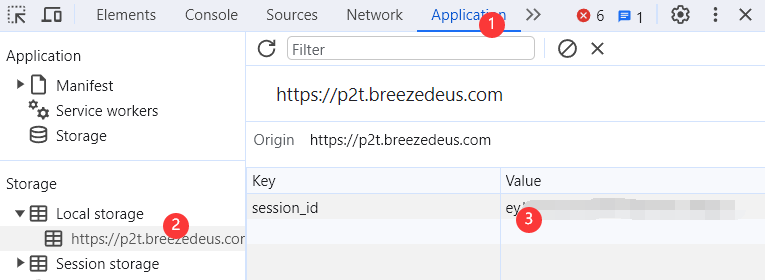

# Pot-App Formula Recognition [Pix2Text](https://p2t.breezedeus.com/) API Plugin

[简体中文](https://github.com/ygguorun/pot-app-recognize-plugin-pix2text/blob/main/README.md) | English

### Usage

1. Obtain Pix2Text SESSION_ID

   - Register and log in to [Pix2Text](https://p2t.breezedeus.com/).

   - Open the browser's developer console (F12), go to the "Application" tab, select "Local Storage" under "Storage" on the left, and look for the `session_id` on the right.

   

2. Download and Install the Plugin

   - Download the plugin for your platform.
   - After installation, enter the `session_id`.

### Important Notes

**Pix2Text has a daily character recognition limit of 10,000 characters. Please do not abuse this service.**

### Acknowledgments

- [pot-app/pot-desktop](https://github.com/pot-app/pot-desktop)
- [breezedeus/Pix2Text](https://github.com/breezedeus/Pix2Text)
